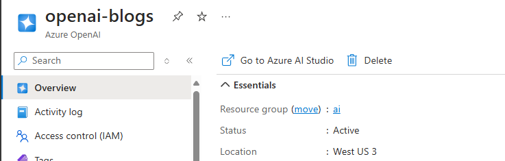

# Blogs


**IMPORTANT DISCLAIMER**
*This is an early alpha version which is not complete and work in progress. It will evolve in the coming weeks and progress will be documented here. If you have any feedback, please share it with me at florian.boigner@microsoft.com* 

**Changelog**

| Update | Version | Date | 
| --- | --- | --- |
| Initial version with limited functionality. Reporting and Power Platform not available yet | alpha 0.1.1 | 05/12/2024 |

## Introduction

Blogs is a solution that allows you to collect and *follow* online blogs that have an RSS Feed, automatically create a summary and get a Newsletter with the updates in your inbox. The functionality and solution will be extended over time and currently includes the following elements:
- A [SharePoint online list](#sharepoint-list) to store the blogs
- A Dataflow that retrieves the data from the list
- Different notebooks that process the data, get the RSS feeds and summarize them
- OpenAI service to create the summary and Azure KeyVault to store the secrets
- A Power BI Semantic Model and Report to view the data
- A Power Automate solution to send automatic emails

## Setup

This documentation walks you step-by-step through setting up the elements and services needed for the solution to work. 

### SharePoint list

First we need to create a SharePoint list which will be used to store the blogs. It can be a regular list on any SharePoint site, in the sample solution I am using [Microsoft Lists](https://www.microsoft.com/en-us/microsoft-365/microsoft-lists). Create a new list "Blogs" with the following columns:
- **Title** (default column, text): used for the name of the blog
- **RSS Feed** (text / single line of text): Used for the RSS feed URL
- **Categories** (choice, with option *Allow multiple selections* enabled): This is used to tag the blog with categories, that you can use to filter later on. In the solution I use categories like *Power BI*, *Fabric*, *Adoption & Governance*, *Power Query* and more, but this is entirely up to you to customize

Example of a populated list: 


Please take note of the URL of your list in the following format: https://{tenant name}.sharepoint.com/. Also remember the name that you gave to your list. 

Lastly, add at least one entry for testing! If you are out of ideas, how about the Microsoft Fabric Blog? 

| Title | RSS Feed | Categories |
| --- | --- | --- |
| Microsoft Fabric Updates Blog | https://blog.fabric.microsoft.com/en-gb/blog/feed/ | Fabric |

Most blogs will have an icon that allows you to access the RSS Feed. If not, you can try if it works by adding /feed at the end or other similar patterns. 

### OpenAI

Navigate to https://portal.azure.com and search for Azure OpenAI. Select *Create* to add a new service and enter the following details:

- Subscription
- Resource group (select an existing one or create a new one)
- Region
- Name
- Pricing tier (this will always be S0, which is Pay-As-You-Go, unless you have access to another tier)


Select next until the validation screen and click *Create*. 

After a few minutes, your service will be deployed. Select the *Keys and Endpoint* section in the left menu and take note of the **KEY 1** and the **Endpoint**. These are the connection details that we will use later on.

Navigate to the newly created OpenAI service and select *Go to Azure AI Studio* (recently renamed to Azure AI Foundry), which is where we can configure the deployment. 



In Azure Open AI Foundry, select *Deployments* in the left menu section, then *Deploy model* and *Deploy base model*. You can now select any model that specializes on "Chat completion". I will select **gpt-4o-mini** and *confirm*. On the next screen, confirm using *Deploy*. 

You will see a summary screen of your deployment. You can close the window or test the model in the *Chat section of the left menu.


### Azure KeyVault

Next we want to setup an Azure KeyVault, to securly store our secret. For this, search for *Key vaults* in the Azure portal and select *Create*. Fill in the following details and keep the rest with default settings: 

- Subscription
- Resource group (can be the same than before or a different one)
- Key vault name
- Region
- Pricing tier (I recommend *Standard*)

Once completed, navigate to the newly created KeyVault and take noe fo the *Vault URI* that you see on the right side of your screen in the *Overview* section. It will have the format https://{your keyvault name}.vault.azure.net/.

Then select *Secrets* in the left menu. Select *Generate/Import* and type a name for your secret (e.g. *blogsopenaikey*) and copy the OpenAI service key (KEY 1) into the Secret value. Take note of the secret name. 

In the left section *Access control (IAM)* select *Add -> Add role assignment*. Assign yourself the following permissions:
- **Key Vault Secrets Office**: Allows you to see and change the secrets that you created. 

### Fabric

#### Create workspace

Navigate to [Microsoft Fabric](https://fabric.microsoft.com/) and select the *Data Engineering* experience. [Create a new Workspace](https://learn.microsoft.com/en-us/fabric/get-started/create-workspaces) and make sure that you select either a Fabric Trial capacity or a paid Fabric capacity in the *Advanced* settings. You will automatically navigate to the newly created workspace. 


#### Import notebooks and create environment

Download the [CONFIG.ipnyb](notebooks/CONFIG.ipnyb) and [nb_setup Environment.ipnyb](notebooks/nb_setup Environment.ipnyb) notebooks from Github. In you Fabric workspace, select *Import -> Notebook -> From this computer* and upload both notebooks. 


Open the CONFIG notebook and adapt the parameters. First let's adapt the required values, which you have taken note of throughout the setup. They are marked through a comment in the style *\<ENTER SOMETHING HERE\>*:
- workspaceName: The name of the workspace you created, e.g. *Blogs*
- keyvault: The endpoint for the keyvault that you created
- secretname: The name that you gave the OpenAI Key secret within the keyvault
- openAiEndpoint: The endpoint for the OpenAI service that you created

All other parameters are set with default values and can be adapted if you want, but can also stay as they are. Initially, it is recommended to keep the default unless you know the impact of your changes. 

As next step, let's open the *nb_setup_environment* notebook. This notebook will create the core environment for you and also import the other notebooks automatically. You can just run the notebook by selecting *Run all* in the menu. All notebooks within the Blogs solution will start by calling the CONFIG notebook.

```python
%run CONFIG
```

By doing so, it will get access to all the variables defined in the CONFIG, and we do not need to change them in multiple places. 

#### Configure environment

By executing the notebook to setup the environment, an *Environment* item was created as well (default name *environment_blogs*). This represents a Spark environment that can be used to install libraries and configure Spark settings, which can then be passed to the notebooks. The setup already linked the environment to the notebooks, but we still need to customize it. Open the environment, then make the following configurations:
- Select **Public libraries** in the menu and click on *Add from PyPI*. Add the following libraries:
  - feedparser
  - trafilatura
  - openai
- Select **Spark properties** and add the following entries:
  - sprk.sql.parquet.vorder.enabled | true
  - spark.microsoft.delta.optimizeWrite.enabled | true

Save the changes and then click *Publish*. It will show the changes to the environment and will ask you to confirm twice through *Publish all* and *Publish*. 


<u>Note:</u> The publishing process can take quite long (about 15 minutes), but you can continue with the next task. Make sure that the process completes before running the solution. 

#### Create Dataflow

Start by downloading the [Dataflow template](dataflows/df_get_blogs.pqt) from Github. Create a new Dataflow Gen2 in the workspace. Rename it, by clicking on its name on the top left, e.g. to *df_get_blogs*. In the center of the screen, select *Import from a Power Query template* and chose the downloaded .pqt template. 


Next, configure the two parameters:
1. **SharePointUrl**: The base URL of your SharePoint on which you created the list (e.g. https://{tenant name}.sharepoint.com/)
2. **ListTitle**: The name of your List (e.g. "Blogs")

Once configured, you need to authenticate. Select *Manage connections* in the ribbon menu and you will see a SharePoint connection with a warning sign. Click on the plus sign and authenticate. 


Close the window, navigate to the *Source* table and click the *Refresh* button in the ribbon. The data should load. 

Now select the blog_categories table and on the bottom right click the plus sign next to *Data destination*. Select *Lakehouse*, authenticate and then chose the Workspace and raw Lakehouse (default is lh_raw). Keep the Table name *blog_categories* and click next. On the following screen, you can keep the default settings and select *Save settings*. Repeat the steps for the *blogs* table.


When completed, click the *Publish* button on the bottom right. The Dataflow will save and directly start the refresh. Wait a few minutes for the data to refresh to complete (you will see a little moving circle next to the Refreshed date) and confirm that both tables appear in the raw Lakehouse, see screenshots below. You might need to refesh the tables by right clicking on the *Tables* folder in the Lakehouse and selecting *Refresh*, if you don't see them right away. 


Now navigate to the second lakehouse (lh_transformed) and complete the following steps:
- Select *Get data -> New shortcut -> Microsoft OneLake -> lh_blogs_raw*, then open the Tables and select both tables that we created using the Dataflow
- Select *Next* and *Create*
- Make sure that both tables appear in the Lakehouse


### Power Platform (NOT COMPLETE, SKIP FOR NOW)

Now we need to import the the solution into Power Platform, to create the Power Automate Flow that will send the newsletter. First, download the solution template (.zip) from Github: [Blogs.zip](powerplatform/Blogs_1_0_0_1.zip).

Navigate and login to https://make.powerautomate.com/ and select *Solutions* in the left menu. On the top menu, select *Import solution*, browse for the downloaded Zip-file and select next twice. You will reach a screen where you need to setup the connections. Make sure to login and once completed select *Import*.


Importing a solution can take a bit of time, we will continue with the following steps and come back to test at a later point. 


## Run the solution

To run the solution, the following steps need to be taken in sequence: 
1. Add blog feeds to the SharePoint list
2. Refresh the Dataflow *df_get_blogs*
3. Run notebook *nb_get_feeds* to retrieve the feeds
4. Run notebook *nb_get_blogs* to get the blogposts
5. Run notebook *nb_create_summary* to generate the summaries with OpenAI